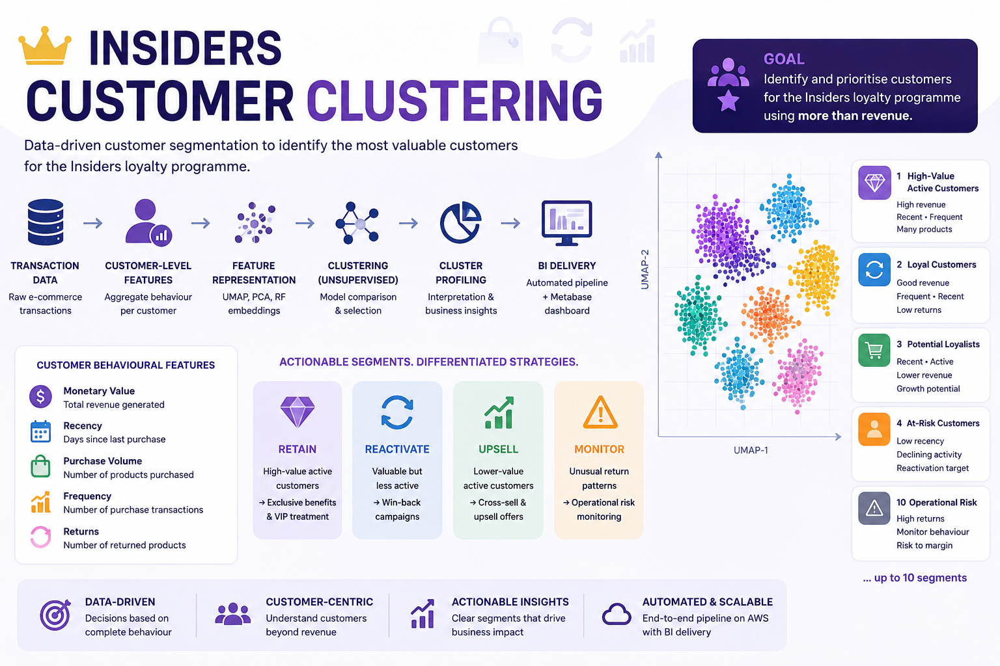
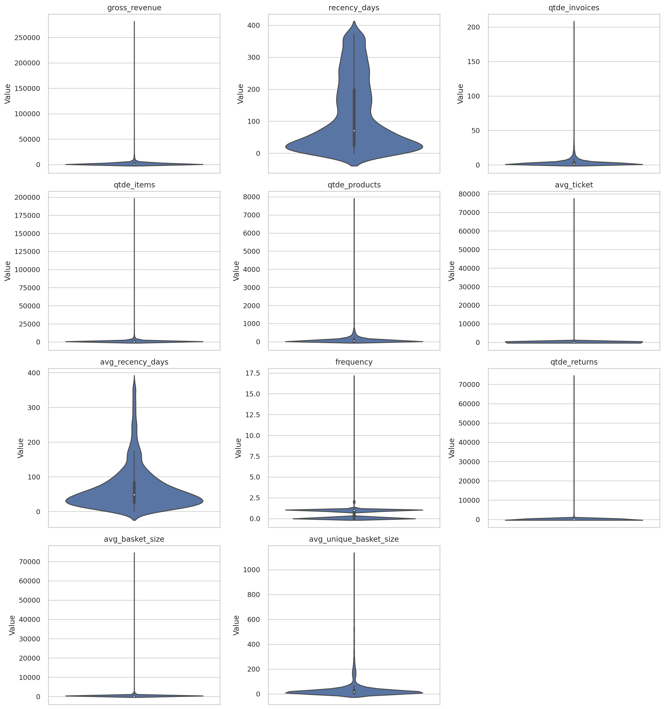
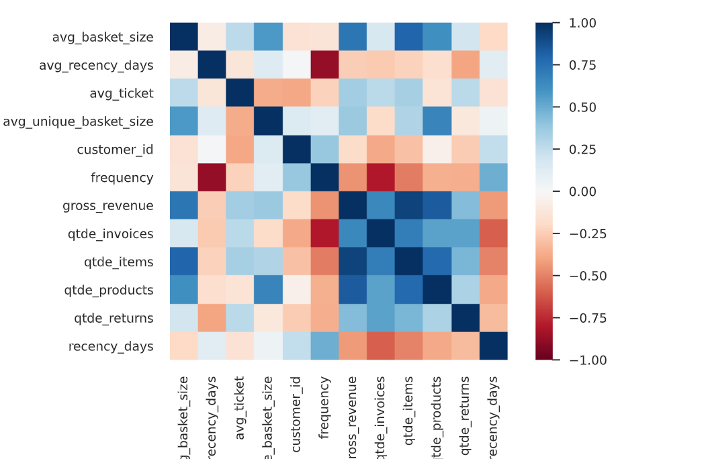
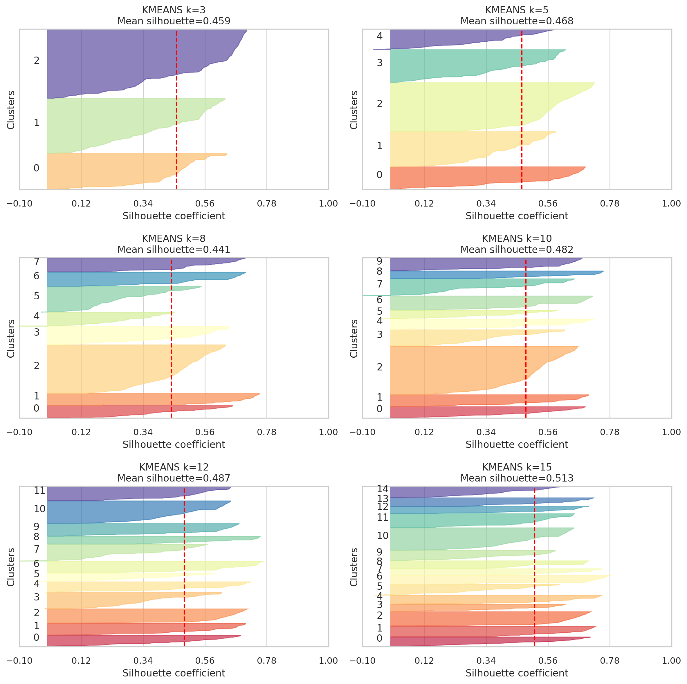
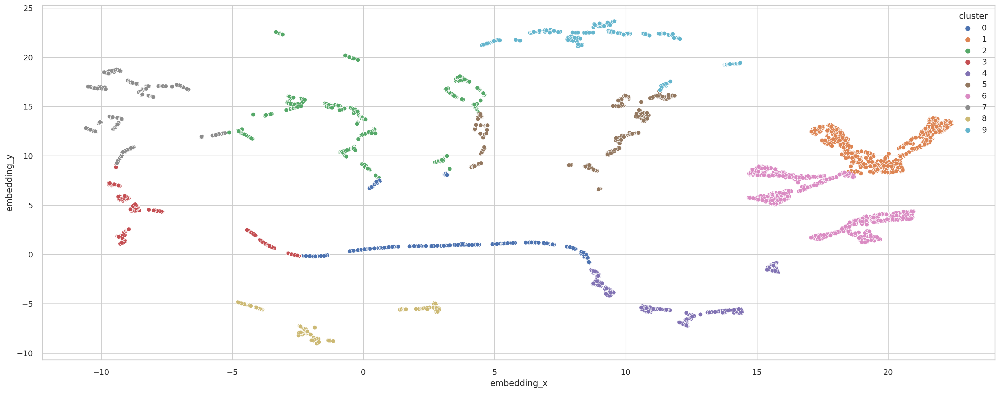
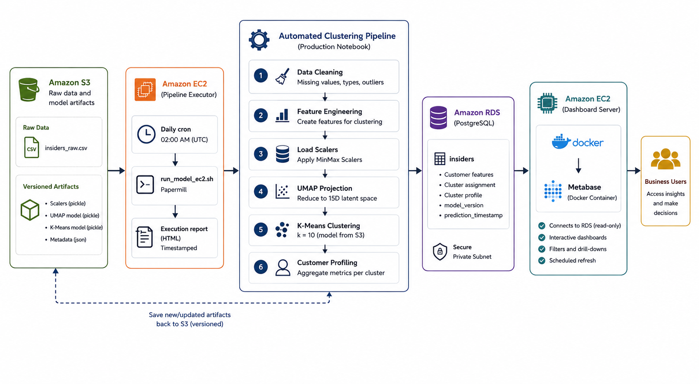
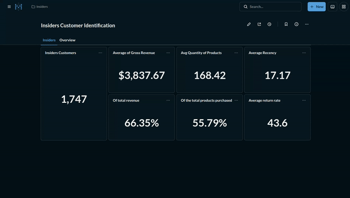

# Insiders Customer Segmentation

[](https://www.python.org/)
[](https://scikit-learn.org/)
[](https://aws.amazon.com/)
[](https://www.postgresql.org/)
[](https://www.docker.com/)
[](https://www.metabase.com/)




End-to-end customer segmentation for an e-commerce loyalty programme. The project transforms transaction-level data into actionable customer groups, identifies the highest-value **Core Insiders** segment, and delivers results through an automated AWS pipeline and Metabase.
## Next Steps

- Add data-quality checks, structured logging, retries, and alerting to the production pipeline.
- Monitor cluster stability, data drift, and segment movement over time.
- Validate campaign impact with an A/B test or another controlled experiment.
- Enrich the dataset with product, payment, demographic, and channel attributes to test additional hypotheses.


## Project Overview

The marketing team needs to identify the customers who should be prioritised for the **Insiders** loyalty programme. Revenue alone is not sufficient: recency, purchasing volume, purchase frequency, and return behaviour provide a more complete view of customer value and operational cost.

This project delivers an interpretable, data-driven segmentation that supports differentiated strategies for retention, reactivation, upselling, and operational-risk monitoring. It covers exploratory analysis, customer-level feature engineering, unsupervised model comparison, cluster profiling, automated execution, and BI delivery.

The primary analysis and validation are in [c08_lr_validation of hypothesis.ipynb](<notebooks/c08_lr_validation of hypothesis.ipynb>). The production implementation is [c10_lr_deploy.ipynb](src/models/c10_lr_deploy.ipynb).

## Business Problem

The company operates an e-commerce business and intends to launch **Insiders**, a loyalty programme for its most valuable customers. The objective is to segment customers by purchasing behaviour and identify the group that merits priority treatment, without reducing customer value to revenue alone.

The final output must be actionable: high-value active customers can receive exclusive retention benefits; valuable but less active groups can be reactivated; lower-value active groups can be targeted for upsell; and unusual return patterns can be monitored as an operational risk## Next Steps

- Add data-quality checks, structured logging, retries, and alerting to the production pipeline.
- Monitor cluster stability, data drift, and segment movement over time.
- Validate campaign impact with an A/B test or another controlled experiment.
- Enrich the dataset with product, payment, demographic, and channel attributes to test additional hypotheses..

## Dataset

The development input is `data/raw/Ecommerce.csv`; production loads the raw CSV from Amazon S3. The source contains **541,909 transactions** and these fields:

| Field | Description |
| --- | --- |
| `InvoiceNo` | Invoice / transaction identifier |
| `StockCode` | Product identifier |
| `Description` | Product description |
| `Quantity` | Purchased or returned quantity; negative values represent returns |
| `InvoiceDate` | Transaction timestamp |
| `UnitPrice` | Item unit price |
| `CustomerID` | Customer identifier |
| `Country` | Customer country |

After preprocessing, the modelling dataset contains **5,695 customer profiles**.

## Methodology

### 1. Exploratory Data Analysis

The analysis checks the dataset schema, missing values, descriptive statistics, feature distributions, outliers, and bivariate relationships before modelling. Overall, no general abnormal pattern was found in the EDA. The exception was customer **`16446`**, whose extreme return behaviour made the profile anomalous; this customer was removed from the modelling population.

#### 1.1 Univariate Analysis

The numerical features exhibit predominantly **right-skewed distributions**, with most customers concentrated at lower values and a small number presenting extremely high values. This behaviour is particularly pronounced in `gross_revenue`, `qtde_invoices`, `qtde_items`, `qtde_products`, `avg_ticket`, `frequency`, `qtde_returns`, `avg_basket_size`, and `avg_unique_basket_size`, which present high skewness and kurtosis.

##### Descriptive Statistics

| Feature | Mean | Median | Std | Min | Max | Range | Skew | Kurtosis |
|---|---:|---:|---:|---:|---:|---:|---:|---:|
| `customer_id` | 16,640.76 | 16,269.00 | 2,825.26 | 12,346.00 | 22,709.00 | 10,363.00 | 0.42 | -0.86 |
| `gross_revenue` | 1,774.30 | 613.20 | 7,582.21 | 0.42 | 279,138.02 | 279,137.60 | 22.59 | 675.62 |
| `recency_days` | 116.93 | 71.00 | 111.65 | 0.00 | 373.00 | 373.00 | 0.81 | -0.64 |
| `qtde_invoices` | 3.47 | 1.00 | 6.81 | 1.00 | 206.00 | 205.00 | 13.19 | 302.09 |
| `qtde_items` | 964.43 | 317.00 | 4,300.21 | 1.00 | 196,844.00 | 196,843.00 | 24.07 | 863.40 |
| `qtde_products` | 92.61 | 41.00 | 210.58 | 1.00 | 7,838.00 | 7,837.00 | 17.75 | 510.29 |
| `avg_ticket` | 44.75 | 15.85 | 1,043.80 | 0.42 | 77,183.60 | 77,183.18 | 71.30 | 5,245.74 |
| `avg_recency_days` | 67.43 | 48.39 | 63.73 | 1.00 | 366.00 | 365.00 | 2.07 | 4.92 |
| `frequency` | 0.55 | 1.00 | 0.55 | 0.01 | 17.00 | 16.99 | 4.86 | 139.14 |
| `qtde_returns` | 31.40 | 0.00 | 996.50 | 0.00 | 74,215.00 | 74,215.00 | 71.60 | 5,313.57 |
| `avg_basket_size` | 261.11 | 151.67 | 1,074.15 | 1.00 | 74,215.00 | 74,214.00 | 58.33 | 3,957.96 |
| `avg_unique_basket_size` | 37.26 | 15.00 | 76.88 | 0.20 | 1,109.00 | 1,108.80 | 5.07 | 32.89 |




#### 1.2 Bivariate Analysis

The **correlation analysis** was used to identify relationships between numerical features and assess potential redundancy among the variables. The correlation structure was considered alongside the pairplot analysis to identify features with limited variance or redundant information.



Several revenue and transaction-volume features showed strong positive correlations, indicating overlapping information. In contrast, `recency_days` provided a distinct temporal dimension, while `qtde_returns` captured customer return behaviour with relatively weaker correlations to the other features.

Based on these results, the final feature set was defined as **`gross_revenue`, `recency_days`, `qtde_products`, `frequency`, and `qtde_returns`**, covering complementary dimensions of customer value, recency, purchasing volume, purchase frequency, and return behaviour.

The pairplot analysis is available [here](images/pairplot.png).

### 2. Data Cleaning

- Column names are standardised to `snake_case` and data types are corrected.
- Missing customer IDs are recovered with an auxiliary invoice-level identifier when possible.
- Records with `unit_price < 0.04` are removed.
- Non-product stock codes (for example postage, discounts, fees, and manual adjustments) are excluded.
- `European Community` and `Unspecified` country values are excluded for this first cycle.
- Purchases (`quantity > 0`) and returns (`quantity < 0`) are separated for feature creation.
- Customer `16446` is excluded after the anomaly assessment.

### 3. Feature Engineering

The raw transaction table is aggregated to one record per customer. The final model retains five features that jointly represent monetary value, engagement, purchasing scale, and return behaviour:

| Feature | Engineering logic | Business interpretation |
| --- | --- | --- |
| `gross_revenue` | Sum of `quantity × unit_price` for purchase transactions | Historical monetary value |
| `recency_days` | Days since the customer's latest purchase, relative to the latest date in the dataset | Current activity; lower is more recent |
| `qtde_products` | Count of purchased product records | Purchasing volume |
| `frequency` | Distinct invoices divided by active days, with a zero-day safeguard | Purchasing cadence |
| `qtde_returns` | Absolute sum of returned quantities; zero when there are no returns | Return-related operational cost / risk |

Additional features explored during the project include invoice count, average ticket, average recency, and average basket size. They were not retained in the deployed model because the final selection provides a clearer, less redundant representation of customer behaviour.

### 4. Scaling and Feature Preparation

The clustering algorithms are distance-based, so features measured in different units cannot be used directly. Each final numeric feature is fitted independently with `MinMaxScaler` and transformed to the `[0, 1]` range. This prevents high-magnitude variables—such as revenue or product volume—from dominating the distance calculation.

The fitted scalers are serialised during model development and versioned in S3 for production reuse. Using the same fitted transformations in deployment preserves consistency between the validation population and daily predictions.

### 5. Embedding Evaluation

The analysis compares the original scaled feature space with PCA, t-SNE, UMAP, and a Random Forest leaf embedding followed by UMAP. PCA was not adopted because its two-dimensional projection did not show sufficiently separated structure for the business use case. The selected representation is a two-dimensional UMAP embedding, which provides the clearest balance of cluster separation and interpretability.

### 6. Model Fine-Tuning and Validation

K-Means, Gaussian Mixture Models (GMM), and hierarchical clustering with Ward linkage are compared across candidate representations. DBSCAN is also explored in the notebook through a k-nearest-neighbour distance plot and a search over `eps` and `min_samples`.

The principal internal metric is the Euclidean silhouette score, supported by silhouette plots and business interpretability. The table below reproduces the comparison at the deployed choice of **10 clusters**; K-Means on UMAP is the strongest candidate at this business-friendly cluster count.

| Rank at k=10 | Algorithm | Representation | Silhouette score | Decision |
| ---: | --- | --- | ---: | --- |
| 1 | K-Means | UMAP (2D) | **0.482** | Selected for production |
| 2 | Hierarchical clustering (Ward) | UMAP (2D) | 0.477 | Not selected |
| 3 | K-Means | Original scaled feature space | 0.455 | Not selected |
| 4 | K-Means | t-SNE (2D) | 0.436 | Not selected |
| 5 | K-Means | Leaf embedding + UMAP (2D) | 0.424 | Not selected |
| 6 | GMM | UMAP (2D) | 0.400 | Not selected |

Although some higher values of k achieve better silhouette scores, k=10 was selected as a balance between cluster separation and business interpretability. This provides a practical number of actionable customer segments while maintaining strong clustering performance. The deployed solution uses the fitted 10-cluster K-Means model on the UMAP-based representation.




#### Silhouette Analysis ($k=10$)

* **Overall Metric:** Mean silhouette coefficient of **0.482** (outperforming $k=3, 5, 8$), indicating reasonable overall cluster separation.
* **Cluster Quality:** Most clusters (0, 1, 2, 3, 5, 7, 8, and 9) exceed the global mean for internal cohesion.
* **Key Limitations:** 
  * **Noise/Overlap:** **Cluster 6** displays negative silhouette values, pointing to misclassified or overlapping samples.
  * **Imbalance:** Significant variation in cluster sizes, with **Cluster 2** holding a disproportionately large share of the data compared to smaller groups (4, 6, and 7).

### 7. Cluster Profiling and Hypothesis Validation

Clusters are ranked by average gross revenue and relabelled from 1 (highest average revenue) to 10. The resulting labels make the output accessible to business stakeholders.

| Cluster | Business name | Customers | Share | Average revenue | Primary action |
| ---: | --- | ---: | ---: | ---: | --- |
| 1 | Core Insiders | 1,747 | 30.68% | 3,837.67 | Priority loyalty and retention |
| 2 | Reactivation Opportunity | 508 | 8.92% | 1,452.53 | Reactivate |
| 3 | Strong Mid-Tier Segment | 425 | 7.46% | 1,048.81 | Retain and grow |
| 4 | High Operational Risk | 377 | 6.62% | 1,025.75 | Monitor return-related cost |
| 5 | Reactivation Target | 401 | 7.04% | 975.40 | Win-back campaign |
| 6 | Low-Priority Reactivation | 277 | 4.86% | 906.62 | Low-cost reactivation |
| 7 | Low Business Priority | 585 | 10.27% | 654.03 | Maintain efficiently |
| 8 | Passive Customer Base | 309 | 5.43% | 617.43 | Nurture / observe |
| 9 | Growth Opportunity | 610 | 10.71% | 595.32 | Upsell |
| 10 | Inactive Low-Value Customers | 456 | 8.01% | 550.65 | Lowest priority |

The validation confirms the commercial relevance of the Insiders group: Cluster 1 represents **30.68%** of customers, **55.79%** of purchased product records, and **66.35%** of total gross revenue. Its median revenue is at least 10% higher than the population median.

Measuring the incremental impact of the loyalty programme would require an A/B test with real customers, comparing eligible customers who receive the Insiders benefits with a randomly assigned control group. This causal validation is outside the scope of this academic portfolio project.

### 8. Final Model

| Item | Result |
| --- | --- |
| Algorithm | K-Means |
| Representation | UMAP, 2 dimensions |
| Input features | Revenue, recency, product count, frequency, returns |
| Number of clusters | 10 |
| Validation metric | Silhouette score |
| Silhouette score | 0.482 |
| Modelling population | 5,695 customers |

### 9.2 UMAP 2D Cluster Map

The UMAP projection is the selected embedding used by the final clustering model. It should be displayed with colour-coded cluster labels to communicate the separability and relative density of the customer groups.




## Production Architecture




| Component | Responsibility |
| --- | --- |
|  | Stores the raw CSV and versioned scaler, UMAP, and K-Means artefacts. |
|  **Pipeline** | Hosts the repository and triggers the scheduled model execution. |
|  `run_model_ec2.sh` | Executes the production notebook daily and saves a timestamped execution report. |
|  | Applies the validated cleaning and transformations, assigns clusters, and profiles customers. |
|   | Persists the `insiders` table, including the model version and prediction timestamp. |
|  **Metabase** | Hosts the Metabase service in a Docker container and connects to the PostgreSQL database. |
|  ·  | Delivers interactive dashboards to business users. |

The production notebook reuses the model artefacts stored in S3 under the configured model version. The database uses `(customer_id, model_version)` as its primary key, avoiding duplicate inserts for an already processed version.

## Metabase Dashboards

Two dashboards translate the model output into business decisions:

- **Cluster overview:** compares customer count, revenue, purchasing volume, recency, frequency, and returns across all groups.
- **Core Insiders:** focuses on the highest-priority segment for loyalty, retention, and campaign targeting.



## Project Structure

```text
.
├── data/
│   ├── raw/Ecommerce.csv                 # Development dataset
│   └── processed/insiders_db.sqlite      # Database used by the dashboard
├── notebooks/                            # Analysis and experimentation cycles
│   └── c08_lr_validation of hypothesis.ipynb  # Final analysis and validation
├── reports/
│   ├── customer_profile_report.html      # Customer profiling report
│   └── figures/                          # Project visualizations
├── src/
│   ├── data/                             # Data loading and preparation
│   ├── features/                         # Feature transformations and scalers
│   └── models/
│       ├── c10_lr_deploy.ipynb           # Production pipeline
│       ├── kmeans_model.pkl              # Trained clustering model
│       └── umap_embedding.pkl            # Trained UMAP embedding
├── Dockerfile                            # Metabase dashboard container
├── run_model.sh                          # Local pipeline runner
├── run_model_ec2.sh                      # EC2 scheduled runner
├── requirements.txt
└── setup.py
```

## Technologies

| Category | Technologies |
| --- | --- |
| Programming | Python, pandas, NumPy |
| Machine learning | scikit-learn, UMAP-learn, SciPy |
| Analysis and visualisation | Jupyter, Matplotlib, Seaborn, Plotly, Yellowbrick |
| Cloud and storage | Amazon S3, Amazon EC2, Amazon RDS, PostgreSQL |
| Automation | Papermill, Bash, cron |
| BI | Metabase |

## Running the Project

### Analysis

```bash
git clone <repository-url>
cd insiders_clustering
python -m venv .venv
source .venv/bin/activate
pip install -r requirements.txt
pip install -e .
jupyter notebook 'notebooks/c08_lr_validation of hypothesis.ipynb'
```

Ensure that `data/raw/Ecommerce.csv` is available locally. **TO DO:** consolidate optional notebook dependencies into a locked, reproducible environment.

### Production pipeline

Run the deployment notebook locally with Papermill:

```bash
bash run_model.sh
```

On EC2, configure daily cron execution of:

```bash
bash /home/ubuntu/insiders_clustering/run_model_ec2.sh
```

Provide S3 access and RDS credentials through environment variables; never commit credentials to the repository.

```dotenv
DB_HOST=TO_DO
DB_PORT=5432
DB_NAME=TO_DO
DB_USER=TO_DO
DB_PASSWORD=TO_DO
```

## Next Steps

- Add data-quality checks, structured logging, retries, and alerting to the production pipeline.
- Monitor cluster stability, data drift, and segment movement over time.
- Validate campaign impact with an A/B test or another controlled experiment.
- Enrich the dataset with product, payment, demographic, and channel attributes to test additional hypotheses.

## Author

**Leonam Miranda**

Data Science / Machine Learning portfolio project.
